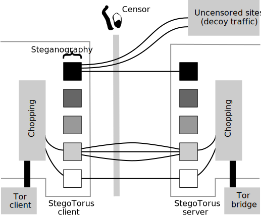

# Stegotorus

**Stegoturs** is a Free (s in freedom) pluggable transport (PT: [IntroPT]) 
development framework which streamlines the job of developing of smarter and
stealthier pluggable transports than the conventional ones currently in use. 
Stegotorus framework provides an API geared specifically toward the needs of
steganographic protocols. Using these API, developers can write PTs which can
effectively hide from deep packet inspector systems (DPI) as well resisting 
non-descriminative adversarial behavoir such as throtteling and packet and
connection dropping.

Stegotorus disentangle the part of PT code which responsible for managing 
network communication from the part which is responsible for encoding the 
information. In the Stegotorus jargon, the former is known as *protocol* and 
the latter as *steg modules*. A system can have several protocols and steg 
modules working together. In this way, countermeasure to bypass different 
censorship strategy can be develop in modular ways and one or many modules 
can be used in differet situations.

At the heart of Stegotorus is the chopper protocol. Chopper implements a 
protocol similar to TCP/IP over the network transport layer. It chops the 
network flow in small chunks which are encodable by the Steg modules. It
keep track of them and make sure that they arrive safely to the other side
or otherwise tries to send them again perhapse through another route 
(proxy server). Additionally chopper encrypt all of the network traffic.

Steg modules, receives chunks from the chop and try to encode in a the 
format approperiate to be sent on the network and being observed by 
the censor. This could be for example encoding the traffic into another
traffic considered benign by the censor.

Currently two main steg modules is implemented namely: *NoSteg module* and *HTTP 
steg module*. NoSteg module does not performe any extra encoding on the data and
should be used when only Chopper's capabilities  are desired. HTTP Steg module 
encode data chunk in HTTP traffic. Based on the way the HTTP cover traffic is 
generated or obtained there are three different flavor of this HTTP Steg module
is available.

Further details on Stegotorus design can be found in the Stegotorus paper [St12].

[IntroPT]: https://www.pluggabletransports.info/how-transports/ "What Pluggable Transports do"

**Warning:** Stegotorus is still under development and has not been regeriously 
audited. Some feature are still experimental and security issue might still 
exists in the code.

## How to build

Stegotorus has been (cross) built over GNU/Linux and for GNU/Linux, Android and 
MS-Windows. We expect that it can be compiled for other POSIX systems.

### Build requirements

To build Stegotorus you need:

* git
* autoconf
* automake 
* pkgconfig
* openssl >= 1.1.1
* libevent
* libcurl
* yaml-cpp
* libz

Optionally you need:

* libboost
* libboost-system
* libboost-filesystem

if you are intending to run Stegotorus server on the same machine which runs an 
HTTP server and use the http server files as the cover for the Stegotorus 
traffic.

For compiling for GNU/LINUX you need:

* gcc

In a Debian based GNU/Linux you would get these packages by running:

    $ sudo apt-get install build-essential git automake autoconf pkg-config libssl-dev libevent-dev libcurl4-openssl-dev libboost-dev libboost-system-dev libboost-filesystem-dev

If the OpenSSL library in the official distribution repository is older than 1.1.1, you might need to obtain the latest version from 
download it from [OpenSSL][https://www.openssl.org/source/openssl-1.1.1b.tar.gz] website.

For cross-compiling for MS-Windows you will need:

* mingw-64

For cross-compiling for Android you need:

* android-ndk >= r19

Finally you need to clone the Stegtorus repo:

    $ git clone https://github.com/TheTorProject/stegotorus.git
    $ cd stegotorus

### Build for GNU/Linux

Assuming all requirement are installed:

    $ autoreconf -i
    $ ./configure [--without-boost]
    $ make

### Build for MS-Windows

You need the binary of all the the above mentioned libraries cross-compiled for
Windows and accessible to mingw-w64. The binary of these libraries cross-compiled 
for Windows is accessible from Stegotorus release page:

Assuming that your compiler has access to these libraries as well as their 
header files:

    $ autoreconf -i
    $ scripts/build-windows.sh
    
### Build for Android
You need the binary of all the the above mentioned libraries cross-compiled for
android. You can download the binary of these libraries cross-compiled for 
android from Stegotorus release page:

You also need the headers files for those libraries. You can download 
binary of these libraries cross-compiled for Windows here:

    $ export NDK_DIR=/path/to/android-ndk-dir/
    $ export ANDROID_INCLUDE_DIR=/path/to/cross-compiled-libraries/headers/
    $ export ANDROID_LIB_DIR=/path/to/cross-compiled-libraries/binaries/
    $ autoreconf -i
    $ scripts/build-android.sh

### Running tests

Stegotorus needs python 2 to be able to run integration tests.

To run unit and integration tests:

    $ make check

Note that some tests might fail they do not have access to proper cover traffic.

## Deploying Stegotorus 

If you want to:
   - Know more about Stegotorus options.
   - Test Stegotorus in practice.
   - Run a Stegotorus server to help users with Stegotorus clients.
   - Write an application with Stegotorus support.

please read:

## Developing a new Steg module 

If you want to write a new Steg module to encode network traffic in a specific way
or you want to adapt an existing pluggable transport into a Steg module please read

